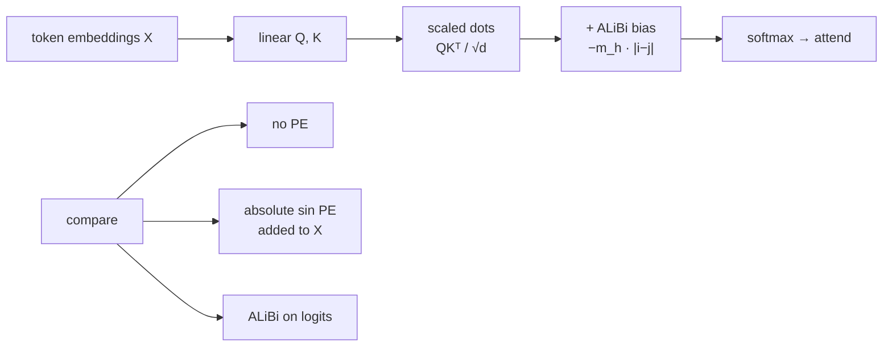

# ai-learn-27-alibi-attention

**ALiBi (Attention with Linear Biases)** from scratch in NumPy — the length-extrapolating positional scheme from Press et al. 2021 (BLOOM, MPT, and others). Natural follow-up to `ai-learn-26-rope-embeddings` (RoPE) and `ai-learn-02` (absolute sinusoidal PE).

Part of the AI learning series (after `ai-learn-26-rope-embeddings`).

## Architecture



## What you'll learn
- How ALiBi adds a **static linear distance bias** `−m_h · |i−j|` to attention logits (no learned PE).
- Why head slopes `m_h` form a **geometric sequence** so heads specialize at different distance scales.
- That ALiBi is **parameter-free** and defined for any length — train short, test long.
- On a near-neighbor retrieval task, ALiBi keeps high accuracy far past `L_train` while absolute sinusoidal PE degrades.
- How ALiBi differs conceptually from RoPE: bias on logits vs rotate Q/K (both encode relative distance; RoPE is multiplicative / phase-based).

## Layout
| file | purpose |
|---|---|
| `alibi.py` | Geometric slopes, bias matrix, apply helper, sinusoidal PE |
| `attention.py` | Tiny multi-head NumPy attention (`none` / `absolute` / `alibi`) |
| `experiments.py` | Locality mass, batch builder, ranking helpers |
| `train_task.py` | Q/K train loop + length-extrapolation eval |
| `run_smoke.py` | Deterministic smoke (seed 42) → `results/` |
| `smoke_plots.py` | SVG plots + RESULTS.md writer |
| `svg_utils.py` | Minify matplotlib SVGs for clean diffs |
| `notebooks/alibi_attention.ipynb` | Step-by-step walkthrough |
| `results/` | `RESULTS.md`, `metrics.json`, `JSON.shot`, SVG plots |

## Run
```bash
pip install -r requirements.txt
python run_smoke.py          # ~1 s on CPU, seed 42, writes results/
jupyter notebook notebooks/alibi_attention.ipynb
```

## Results (seed 42, from `results/metrics.json`)
| check | no PE | absolute sin | ALiBi |
|---|---|---|---|
| near-mass (r=2, random Q/K) | 0.153778 | 0.148311 | **0.27387** |
| top-1 acc @ L_train=16 | 0.2375 | 0.9313 | **1.0** |
| top-1 acc @ L=48 | 0.2 | 0.7312 | **0.9938** |
| wall time | — | — | **~0.55 s** CPU |

Slope sanity (H=4/8 geometric): pass. See [results/RESULTS.md](results/RESULTS.md) for full tables and plots.

## Caveats
- Toy multi-head attention and a synthetic near-neighbor task — not a full Transformer / LM.
- Retrieval masks the query index (distance-0); otherwise ALiBi's self peak trivially wins before learning.
- Softmax uses an educational `logit_scale` so peaks are visible; ranking metrics use the same scores.
- Absolute sinusoidal PE can still extrapolate somewhat; ALiBi's gap widens as `L_test` grows.

## Next steps
- Causal ALiBi decoder on the mini-transformer from `ai-learn-04`.
- ALiBi vs RoPE head-to-head on the same relative-offset + length-extrapolation suite.
- Tunable slopes / learned per-head slopes (ALiBi variants).
