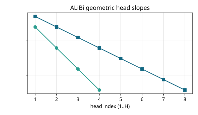
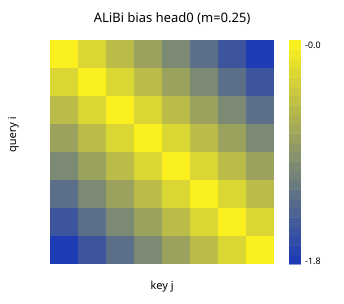
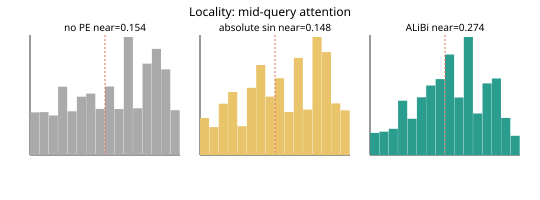
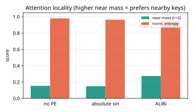
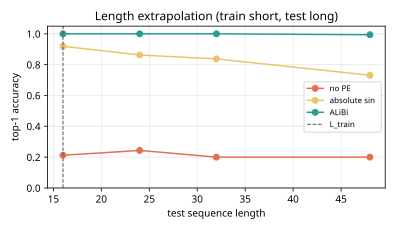
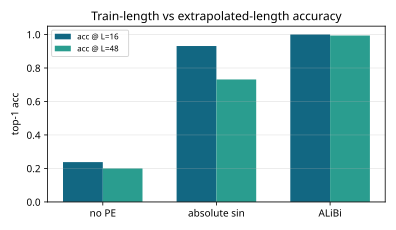

# Results: ai-learn-27-alibi-attention

Real output of `python run_smoke.py` (seed 42, CPU, 0.55 s wall time).

## Setup
- d_model=32, n_heads=4, L_train=16, test lengths=[16, 24, 32, 48], relative offset=1.
- Relative-offset retrieval with 3 content-matched distractors; train Q/K only (V/O frozen unused for ranking).
- Tiny multi-head NumPy attention; 140 steps, logit_scale=8.0.

## Slope sanity
- H=4 slopes: `[0.25, 0.0625, 0.015625, 0.00390625]` pass=True
- H=8 slopes: `[0.5, 0.25, 0.125, 0.0625, 0.03125, 0.015625, 0.0078125, 0.00390625]` pass=True

## Locality (random Q/K, near radius 2, T=32)
| PE | mean near mass | mean entropy |
|---|---|---|
| no PE | 0.153778 | 3.39727 |
| absolute sin | 0.148311 | 3.340955 |
| ALiBi | 0.27387 | 3.303759 |

## Length extrapolation (top-1 acc)
| PE | L=16 | L=24 | L=32 | L=48 |
|---|---|---|---|---|
| no PE | 0.2125 | 0.2437 | 0.2 | 0.2 |
| absolute sin | 0.9187 | 0.8625 | 0.8375 | 0.7312 |
| ALiBi | 1.0 | 1.0 | 1.0 | 0.9938 |

## Headline
- Slope sanity: **pass=True**.
- Locality near-mass: ALiBi **0.27387** > no-PE **0.153778** (absolute 0.148311).
- Acc @ L_train=16: ALiBi **1.0**, absolute **0.9313**, no-PE **0.2375**.
- Acc @ L_max=48: ALiBi **0.9938** vs absolute **0.7312** (ALiBi wins: True).

## Plots
- 
- 
- 
- 
- 
- 

## Notes
- ALiBi bias is parameter-free and defined for any length — absolute PE can fit short contexts but degrades when query/key slots move past L_train.
- Softmax uses an educational logit_scale so peaks are visible; rankings use the same scores.
- Toy multi-head attention, not a full Transformer — the ALiBi math matches Press et al. 2021.
